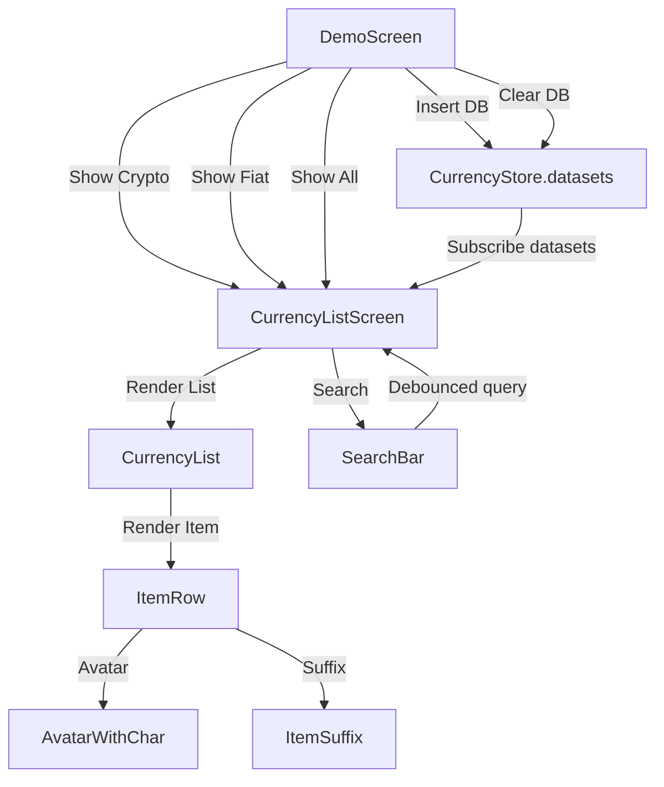

# Currency Demo App

This is a **React Native / Expo** demo app to manage and explore currencies (crypto and fiat). It includes a **local in-memory store**, searchable currency list, database operations, and reusable UI components.  

---

## Demo

**iOS**

https://github.com/user-attachments/assets/53853066-ca05-4dfb-b175-8eab59097bb3


**Android**

https://github.com/user-attachments/assets/7425a6c9-20de-43b8-8a93-e73ac589607e


---

## Features

1. **Currency Store**
   - Uses `zustand` for state management.
   - Supports multiple currency modes: `CRYPTO` and `FIAT`.
   - Functions:
     - `insertDataset(mode, data)`: Insert currency data for a mode.
     - `clearDataset(mode)`: Clear data for a mode.

2. **DemoScreen**
   - Provides buttons to:
     - Clear database
     - Insert mock database
     - Show currencies by type (`CRYPTO` / `FIAT`) or all
   - Uses `router.push` to navigate to `CurrencyListScreen`.

3. **CurrencyListScreen**
   - Displays a list of currencies.
   - Supports filtering by `mode` (`CRYPTO`, `FIAT`) or showing all.
   - Supports search functionality.
   - Uses `SearchBar` with **debounced input** to avoid unnecessary re-renders.
   - Uses `useMemo` for `dataSource` and `filteredData` to optimize performance.

4. **Components**
   - **SearchBar**
     - Handles input, focus state, and debounce internally.
     - Shows clear/search icons conditionally.
   - **CurrencyList**
     - FlatList wrapper.
     - Supports overriding all props.
     - Uses `ItemRow` as render item.
   - **ItemRow**
     - Displays currency name, symbol, and optional avatar.
     - Uses `ItemSuffix` for symbol/chevron.
   - **AvatarWithChar**
     - Displays first character of currency as avatar.

5. **Utilities**
   - `useDebounce` custom hook for debounced callbacks.
   - `matchCurrency(item, { query })`: matches item name/code with query.
      - The coin’s name (e.g. Bitcoin) starts with the search term
      - The coin’s name contains a partial match with a ‘ ’ (space) prefixed to the search term
      - The coin’s symbol starts with the search term
   - `getTestId` for test automation.

6. **Testing**
   - Unit tests for:
     - `CurrencyListScreen`
     - `SearchBar`
     - `CurrencyList` / `ItemRow` / `ItemSuffix`
     - `useDebounce`
   - Mocks required for:
     - `useCurrencyStore`
     - `useRouter`
     - `useLocalSearchParams`
     - `Stack.Screen` header rendering

7. **Navigation**
   - Uses `expo-router`.
   - Screens:
     - `/demo` → DemoScreen
     - `/currency-list` → CurrencyListScreen

8. **State / Optimization**
   - Components optimized with:
     - `React.memo` for `ItemRow`
     - `useMemo` for filtered lists
     - `useCallback` for stable functions
   - Search input is debounced inside `SearchBar` to reduce re-renders.
   - Store functions are directly selected to avoid unnecessary subscription.

---

## Installation

```bash
npm install
npx expo start
```

---

## App Flow Diagram


